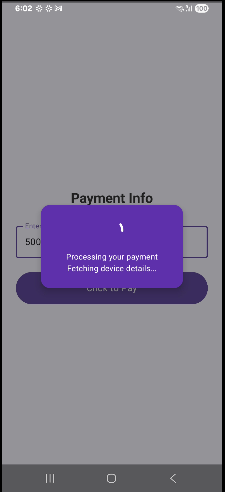
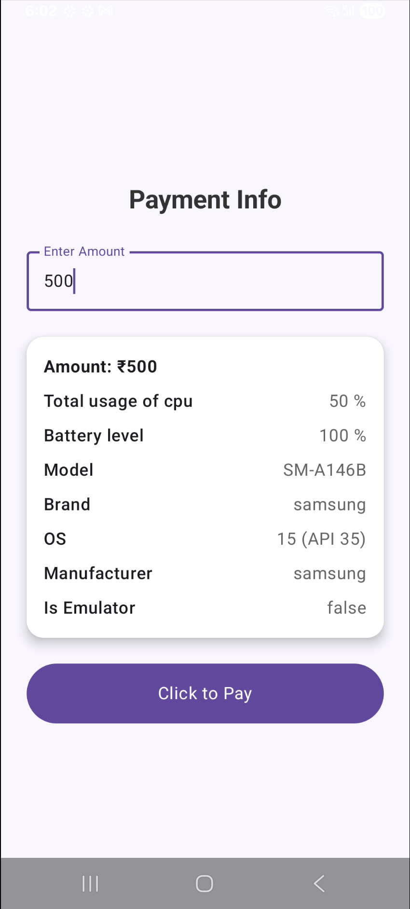

Project Overview
This project demonstrates an inter-process communication (IPC) setup using AIDL between multiple Android modules:

Please find release apks [version1.0.0](https://github.com/sunilparmar04/VeriZPay/releases/tag/Version1.0.0)

VeriZPay (App Module) – The main payment application.

DeviceAnalyticRemote (Remote App) – Runs as a separate process and exposes device health data through a bound service.

DeviceAnalyticInterface (AIDL Interface Module) – Contains the AIDL interface and client code to interact with the remote service.

Key Features
AIDL Integration: Uses IDeviceAnalytics AIDL interface for structured communication between apps.

Remote Service: DeviceAnalyticService (in DeviceAnalyticRemote) provides device information such as battery level, CPU usage, and general device details.

Client Binding: AnalyticService (in DeviceAnalyticInterface) manages service binding and exposes a coroutine-based API (getAnalyticsInterface()) to retrieve device analytics asynchronously.

Clean Architecture: Code is modularized for better separation of concerns, with dedicated modules for UI, IPC, and service implementation.

Use Case
This setup is designed for apps needing secure and efficient access to device analytics from a background service running in a different process, such as monitoring device health during financial transactions.

### App Screens

### Demo Video

